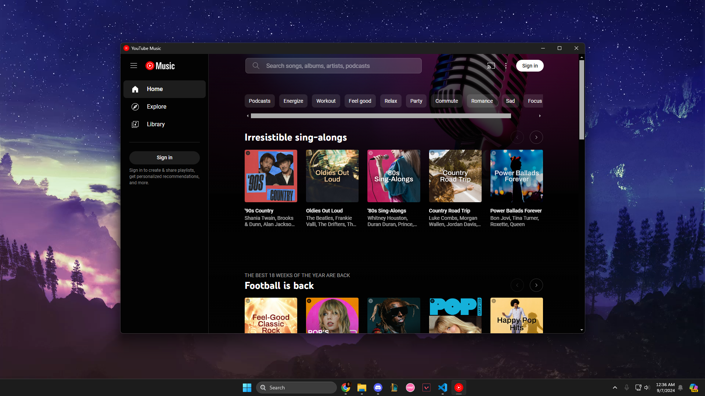

# youtube-music-desktop-app
<!-- TABLE OF CONTENTS -->

  
<h2 style="display: inline-block">Table of Contents</h2>

  <ol>
    <li>
      <a href="#about-the-project">About The Project</a>
      <ul>
        <li><a href="#built-with">Built With</a></li>
      </ul>
    </li>
    <li><a href="#contact">Contact</a></li>
  </ol>

<!-- ABOUT THE PROJECT -->
## About The Project

* An Electron.js desktop app for YouTube Music. Download-friendly! Keep your music with you even when you're offline!

### Built With

* JavaScript
* ElectronJS
* electron-store
* electron-builder

(<a href="#youtube-music-desktop-app">back to top</a>)

### YouTube Music Desktop App

Listen to music on YouTube Music with this Electron app! Has media controls similar to Windows Media Player so you can easily go to the previous song, play, pause, or skip the song upon app hover! 
<u>Auto skips ads.</u>

KNOWN BUG: SONGS/VIDEOS MUST BE PAUSED BEFORE EXITING THE APP

 
Media Controls 

(<a href="#youtube-music-desktop-app">back to top</a>)

### Installation

Install the app by clicking on download next to releases on the right or click <a href="https://github.com/meganle414/YouTube-Music-Desktop-App/tree/main/dist_electron/YouTube Music Desktop App Setup 1.0.0.exe">here</a> and click Download raw file. After downloading the setup file, launch the .exe file and follow the steps to install the application.

Installer Location 
 

Release Location 
 
 

Installer 
 
 
 

(<a href="#youtube-music-desktop-app">back to top</a>)

<!-- CONTACT -->
## Contact

Email: meganle414@gmail.com

Project Link: [https://github.com/meganle414/YouTube-Music-Desktop-App](https://github.com/meganle414/YouTube-Music-Desktop-App)

[linkedin-url]: https://linkedin.com/in/meganle414/

(<a href="#youtube-music-desktop-app">back to top</a>)
